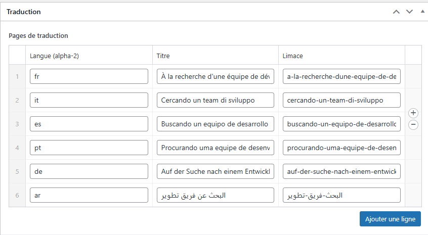

# GPT Auto Translate

**Traduit automatiquement votre contenu WordPress en utilisant l'API GPT et gère les versions linguistiques, idéalement avec Polylang.**

*   **Contributeurs:** (votre nom ou pseudo)
*   **Tags:** translation, multilingual, gpt, openai, automatic translation, polylang, wpml, content translation, ai, auto translate, i18n
*   **Nécessite au moins:** WordPress 5.5
*   **Testé jusqu'à:** WordPress 6.4
*   **Nécessite PHP:** 7.4
*   **Version Stable:** 0.1.0
*   **Licence:** GPLv2 ou ultérieure
*   **URI de la Licence:** [https://www.gnu.org/licenses/gpl-2.0.html](https://www.gnu.org/licenses/gpl-2.0.html)

---

## Description

GPT Auto Translate vous permet d'utiliser la puissance des modèles GPT (comme ceux d'OpenAI) pour traduire automatiquement vos articles, pages et custom post types WordPress dans plusieurs langues.

**Fonctionnalités Clés :**

*   **Traduction Automatique :** Traduit les titres, le contenu principal (en préservant la structure HTML), et les balises meta title/description SEO (supporte Yoast SEO & Rank Math).
*   **Intégration GPT :** Se connecte directement à l'API GPT (ex: OpenAI). Vous fournissez votre propre clé API.
*   **Sélection du Modèle :** Choisissez le modèle GPT spécifique que vous souhaitez utiliser (ex: gpt-4o, gpt-3.5-turbo).
*   **Langues Flexibles :** Définissez les langues cibles en utilisant les codes ISO standards (es, fr, de, ja, etc.).
*   **Sélection du Type de Contenu :** Choisissez pour quels types de contenu la fonctionnalité de traduction doit être activée.
*   **Crée/Met à jour les Traductions :** Crée automatiquement de nouveaux posts pour les traductions ou écrase les existants lorsque vous retraduisez.
*   **Recommandé avec Polylang/WPML :** Conçu pour fonctionner de manière optimale avec des plugins comme **Polylang** (recommandé, gratuit) ou WPML (premium) pour une structure d'URL multilingue robuste, la gestion des langues et des sélecteurs. Ce plugin se concentre sur la *génération* du contenu traduit.
*   **SEO Fallback :** Génère les balises `hreflang` de base si Polylang/WPML ne sont pas détectés.
*   **Sélecteur Fallback :** Offre un sélecteur de langue simple via le shortcode `[gpt_language_switcher]` pour les configurations basiques sans Polylang/WPML.
*   **Intégration Éditeur :** Ajoute une meta box à l'écran d'édition pour déclencher facilement la traduction.

**Important :** Ce plugin nécessite une clé API valide pour un service GPT (comme OpenAI), et vous êtes responsable des coûts associés à l'utilisation de l'API.

---

## Installation

**Prérequis Minimums :**

*   WordPress 5.5 ou supérieur
*   PHP version 7.4 ou supérieure
*   Une clé API valide pour un service GPT (ex: OpenAI) avec accès au modèle choisi.
*   Extension PHP cURL activée sur votre serveur (pour les requêtes API).

**Recommandé :**

*   **Plugin Polylang installé et activé.** C'est **fortement recommandé** pour une structure de site multilingue correcte (URLs comme `/es/page/`), un sélecteur de langue robuste, et une gestion facilitée. GPT Auto Translate fonctionne de manière optimale avec Polylang.

**Étapes d'Installation :**

1.  **Installer GPT Auto Translate :**
    *   **Option A (Admin WordPress) :** Allez dans `Extensions > Ajouter`, recherchez `GPT Auto Translate` (quand il sera sur le dépôt), cliquez `Installer maintenant`, puis `Activer`.
    *   **Option B (Upload) :** Téléchargez le fichier `.zip`. Allez dans `Extensions > Ajouter > Téléverser une extension`, choisissez le fichier zip, cliquez `Installer maintenant`, puis `Activer`.
    *   **Option C (FTP) :** Dézippez le fichier et téléversez le dossier `gpt-auto-translate` dans votre répertoire `/wp-content/plugins/`. Allez ensuite dans `Extensions` dans votre admin WordPress et activez `GPT Auto Translate`.
2.  **(Fortement Recommandé) Installer Polylang :**
    *   Allez dans `Extensions > Ajouter`, recherchez `Polylang`, cliquez `Installer maintenant`, puis `Activer`.
    *   Suivez l'assistant de configuration de Polylang pour définir vos langues (ex: Français par défaut, ajoutez Anglais, Espagnol, etc.). **Assurez-vous que les codes de langue (fr, en, es) correspondent exactement** à ceux que vous utiliserez dans les réglages de GPT Auto Translate.
3.  **Configurer GPT Auto Translate :** Allez dans `Réglages > GPT Auto Translate` dans votre menu d'administration WordPress et suivez les étapes de configuration ci-dessous.

---

## Configuration

Après avoir activé le plugin (et préférablement Polylang), naviguez vers **Réglages > GPT Auto Translate**:

1.  **Clé API GPT (API Key) :** Entrez votre clé API valide fournie par votre service GPT (ex: OpenAI).
2.  **Modèle GPT (GPT Model) :** Sélectionnez le modèle GPT que vous souhaitez utiliser dans la liste déroulante. Assurez-vous que votre clé API a accès à ce modèle.
3.  **Langues Cibles (Target Languages) :** Entrez les codes ISO 639-1 (ex: `en`, `es`, `de`, `ja`) pour les langues dans lesquelles vous voulez traduire, **séparés par des virgules**. Ces codes *doivent* correspondre aux codes configurés dans Polylang si vous l'utilisez.
4.  **Types de Contenu à Traduire (Content Types to Translate) :** Cochez les cases pour les types de contenu (Pages, Articles, etc.) où vous souhaitez voir apparaître la meta box de traduction.
5.  Cliquez sur **Enregistrer les modifications (Save Settings)**.

---

## Comment Utiliser

1.  Modifiez un article, une page, ou un type de contenu personnalisé sélectionné qui est dans la langue principale de votre site (celle configurée comme défaut dans Polylang ou supposée principale).
2.  Assurez-vous que la publication est enregistrée (pas un 'auto-brouillon').
3.  Localisez la meta box **"État de la Traduction GPT" (GPT Auto Translate Status)** (habituellement dans la barre latérale droite).
4.  Elle affichera le statut pour chaque langue cible configurée dans les réglages.
5.  Cliquez sur le bouton **"Traduire / Mettre à jour tout" (Translate / Update All)**.
6.  Le plugin enverra des requêtes à l'API GPT pour chaque langue et chaque champ (titre, contenu, métas). Cela peut prendre un certain temps selon la longueur du contenu et le nombre de langues.
7.  La zone de statut se mettra à jour avec les résultats ("Créé", "Mis à jour", ou messages d'erreur).
8.  **Important :** Après la traduction, les publications traduites sont créées/mises à jour. Si vous utilisez Polylang, elles seront automatiquement liées. Vous pouvez ensuite y accéder via les méthodes standard de WordPress/Polylang ou les liens "Modifier" fournis dans la meta box (après rechargement de la page).
9.  Vous pouvez modifier manuellement les publications traduites par la suite ; vos modifications seront préservées jusqu'à ce que vous cliquiez à nouveau sur "Traduire / Mettre à jour tout" sur la publication *originale*, ce qui écrasera la traduction avec une nouvelle version de GPT.

---

## Foire Aux Questions

### Ce plugin gère-t-il la structure d'URL comme `domaine.com/en/mapage` ?

Pas directement. Ce plugin se concentre sur la *génération du contenu traduit*. Pour des structures d'URL multilingues correctes, la détection de langue, et des sélecteurs de langue robustes, nous **recommandons fortement** de l'utiliser conjointement avec une extension multilingue dédiée comme **Polylang** (gratuit) ou WPML (premium). Configurez d'abord vos langues et votre structure d'URL dans Polylang/WPML.

### Qui paie pour les appels à l'API GPT ?

Vous. Le plugin nécessite votre propre clé API pour un service comme OpenAI. Vous êtes responsable du suivi de votre utilisation et de tous les coûts associés facturés par le fournisseur de l'API.

### Comment gère-t-il le HTML et les shortcodes ?

Le plugin utilise des instructions spécifiques (prompts) pour demander à GPT de préserver la structure HTML et de traduire uniquement le contenu textuel ainsi que les attributs `alt`/`title`. Il demande également à GPT d'ignorer les shortcodes (comme `` `[comme_ceci]` ``). Cependant, du HTML complexe ou des shortcodes inhabituels peuvent occasionnellement poser problème. Relisez toujours les traductions importantes. Les commentaires de blocs WordPress (`` `<!-- wp:... -->` ``) sont retirés avant l'envoi à l'API pour améliorer la fiabilité mais ne sont pas restaurés.

### Comment afficher un sélecteur de langue ?

Si vous utilisez Polylang/WPML, utilisez les options de sélecteur de langue fournies par ces plugins (menus, widgets). Si vous n'utilisez *pas* Polylang/WPML, vous pouvez utiliser le shortcode de secours basique `` `[gpt_language_switcher]` `` dans un widget ou le contenu d'une publication, mais la structure d'URL sera plus simple (ex: `/titre-ma-page-en/`).

### Puis-je modifier les traductions ?

Oui ! Après la création d'une traduction, c'est une publication WordPress normale. Vous pouvez la modifier directement. Vos modifications manuelles persisteront jusqu'à ce que vous déclenchiez à nouveau le bouton "Traduire / Mettre à jour tout" sur la publication *originale*, ce qui écrasera la traduction avec une nouvelle version de GPT.

### La qualité de la traduction est-elle parfaite ?

La qualité de la traduction automatique dépend fortement du modèle GPT utilisé, de la complexité du texte source, et de la paire de langues. Elle est généralement très bonne mais peut nécessiter une relecture ou une édition pour les contenus critiques.

---

## Screenshots

Ici, vous listeriez ou (mieux) intégreriez vos captures d'écran en utilisant la syntaxe Markdown :

1.  
    *(Description: Page de Réglages du Plugin montrant les champs pour la Clé API, le Modèle, les Langues, et les Types de Contenu.)*
2.  
    *(Description: Meta Box de Traduction dans l'Éditeur de Publication, montrant le statut par langue et le bouton de traduction.)*
3.  
    *(Description: Vue d'un article ou d'une page après traduction automatique.)*
4.  
    *(Description: Exemple montrant comment les publications traduites sont liées dans la boîte de langues Polylang.)*

*(Note: Remplacez `assets/screenshot-*.png` par les chemins réels vers vos images. Le dossier `assets` est une convention souvent utilisée pour les images de documentation dans les dépôts Git.)*

---

## Changelog

### 0.1.0

*   Version initiale.
