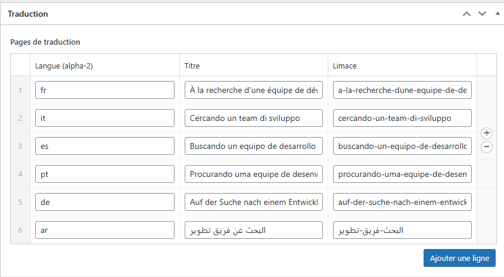
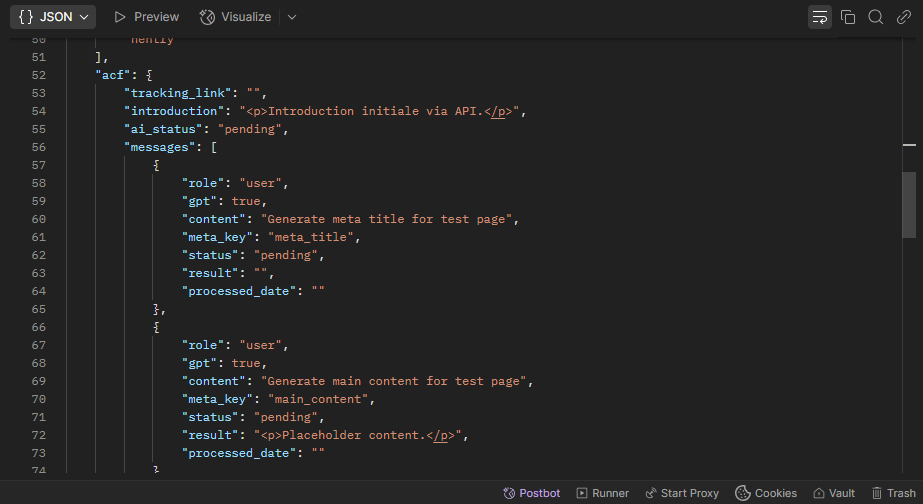

# GPT Auto Translate (ACF/Meta Version)

**Traduit automatiquement le contenu de champs ACF spécifiques via l'API GPT et stocke les traductions dans les métadonnées du post original. Conçu pour fonctionner avec des thèmes utilisant une structure ACF/Meta spécifique pour le multilingue.**

*   **Contributeurs:** BO-VO Digital
*   **Tags:** translation, multilingual, gpt, openai, automatic translation, acf, advanced custom fields, content translation, ai, auto translate, i18n, meta fields, rest api
*   **Nécessite au moins:** WordPress 5.5
*   **Testé jusqu'à:** WordPress 6.7.x (ajuster si besoin)
*   **Nécessite PHP:** 7.4
*   **Version Stable:** 0.2.0-acf
*   **Licence:** GPLv2 ou ultérieure
*   **URI de la Licence:** [https://www.gnu.org/licenses/gpl-2.0.html](https://www.gnu.org/licenses/gpl-2.0.html)

---

## Description

GPT Auto Translate (ACF/Meta Version) vous permet d'utiliser la puissance des modèles GPT (comme ceux d'OpenAI) pour traduire automatiquement le contenu de champs ACF spécifiques (comme un répéteur `messages`) et les métadonnées SEO associées.

**Important :** Cette version du plugin est conçue pour une architecture **spécifique**. Elle ne crée **pas** de posts séparés pour les traductions. À la place :

1.  Elle lit le contenu source depuis des champs ACF définis (principalement le répéteur `messages`).
2.  Elle appelle l'API GPT pour traduire ce contenu.
3.  Elle stocke les traductions résultantes dans des **métadonnées WordPress** sur le **post original**, en utilisant une clé dynamique par langue (ex: `fr_messages_001`, `es_messages_001`).
4.  Elle met à jour un champ répéteur ACF `translation_pages` (en ajoutant les langues manquantes avec titre/slug traduits) et un champ ACF `finder_keys` (textarea) ainsi qu'une méta `finder_keys_meta` (tableau) avec les slugs des traductions.
5.  Elle **dépend d'un thème ou d'une logique externe** pour lire les métadonnées `[lang]_messages_001` et afficher le contenu traduit approprié sur le front-end, et pour utiliser les informations de `translation_pages` pour la navigation/sélection de langue.
6.  Elle expose les champs ACF et les métadonnées pertinentes à l'**API REST de WordPress**, permettant à des outils externes (comme des scripts Python) d'interagir avec les données.

**Fonctionnalités Clés (Version ACF/Meta) :**

*   **Traduction Ciblée :** Traduit le contenu trouvé dans les sous-champs (`result`) d'un répéteur ACF nommé `messages` (configurable implicitement via le code) et les balises meta title/description SEO (supporte Yoast SEO & Rank Math).
*   **Stockage Meta :** Sauvegarde les traductions structurées dans les métadonnées du post original (`[lang]_messages_001`).
*   **Mise à jour Champs ACF Associés :**
    *   Ajoute les langues cibles manquantes au répéteur ACF `translation_pages` (avec titre traduit et slug généré/traduit).
    *   Met à jour le champ ACF `finder_keys` (textarea) et la méta `finder_keys_meta` (tableau) avec la liste des slugs présents dans `translation_pages`.
*   **Intégration GPT :** Se connecte à l'API GPT (ex: OpenAI) via votre clé API.
*   **Sélection du Modèle :** Choisissez le modèle GPT à utiliser (ex: gpt-4o, gpt-3.5-turbo).
*   **Langues Flexibles :** Définissez les langues cibles via les codes ISO.
*   **Sélection du Type de Contenu :** Activez la traduction pour les types de contenu souhaités.
*   **Intégration Éditeur :** Ajoute une meta box pour déclencher la traduction et visualiser le statut (basé sur la présence des métas `[lang]_messages_001`).
*   **Exposition API REST :** Enregistre les champs ACF pertinents (`messages`, `translation_pages`, `finder_keys`) et les métadonnées (`finder_keys_meta`, `[lang]_messages_001`) pour lecture et écriture via l'API REST de WordPress (recommandé avec ACF Pro et son option "Show in REST API").

**Important :** Ce plugin nécessite une clé API valide pour un service GPT (comme OpenAI), et vous êtes responsable des coûts associés. Son bon fonctionnement dépend crucialement de la présence et de la structure des champs ACF (`messages`, `translation_pages`, `finder_keys`) et de la logique du thème qui exploite les métadonnées de traduction `[lang]_messages_001`.

---

## Installation

**Prérequis Minimums :**

*   WordPress 5.5 ou supérieur
*   PHP version 7.4 ou supérieure
*   **Plugin Advanced Custom Fields (ACF) installé et actif.** ACF Pro est recommandé pour la fonctionnalité d'exposition API REST simplifiée.
*   **Une structure de champs ACF spécifique** doit exister (ou être créée par le thème/manuellement) pour les types de contenu cibles, incluant au minimum :
    *   Un champ Répéteur nommé `messages` (avec des sous-champs `meta_key` et `result`).
    *   Un champ Répéteur nommé `translation_pages` (avec des sous-champs `language`, `title`, `slug`).
    *   Un champ Textarea nommé `finder_keys`.
*   Une clé API valide pour un service GPT (ex: OpenAI).
*   Extension PHP cURL activée.

**Recommandé :**

*   **ACF Pro** pour une gestion facilitée de l'exposition des champs à l'API REST.
*   Un **Thème WordPress** spécifiquement conçu pour lire et afficher le contenu depuis les métadonnées `[lang]_messages_001` et utiliser le répéteur `translation_pages` pour la navigation multilingue.

**Étapes d'Installation :**

1.  **Installer ACF / ACF Pro :** Assurez-vous qu'ACF ou ACF Pro est installé et actif.
2.  **Mettre en Place la Structure ACF :** Vérifiez que les groupes de champs "Content AI" (contenant `messages`) et "Translation" (contenant `translation_pages` et `finder_keys`), tels que définis précédemment, sont présents et assignés aux bons types de contenu. Importez-les si nécessaire.
3.  **Installer GPT Auto Translate :**
    *   (Méthodes standard : Admin WP, Upload, FTP - comme dans l'ancienne doc)
4.  **Configurer GPT Auto Translate :** Allez dans `Réglages > GPT Auto Translate` et suivez les étapes ci-dessous.
5.  **(Si ACF Pro) Configurer l'API REST ACF :** Allez dans `Custom Fields > Groupes de Champs`, modifiez "Content AI" et "Translation", et activez l'option **"Show in REST API"** pour les deux. C'est la méthode recommandée pour l'exposition API.

---

## Configuration

Après l'activation, naviguez vers **Réglages > GPT Auto Translate**:

1.  **Clé API GPT (API Key) :** Entrez votre clé API GPT.
2.  **Modèle GPT (GPT Model) :** Sélectionnez le modèle GPT désiré.
3.  **Langues Cibles (Target Languages) :** Entrez les codes ISO 639-1 (ex: `fr`, `es`, `de`, `ar`) des langues de traduction, **séparés par des virgules**.
4.  **Types de Contenu à Traduire (Content Types to Translate) :** Cochez les types de contenu où la meta box doit apparaître (et où les champs ACF sont censés exister).
5.  Cliquez sur **Enregistrer les modifications (Save Settings)**.

---

## Comment Utiliser

1.  Modifiez un article/page/CPT où la traduction est activée et qui contient des données dans le champ ACF `messages`.
2.  Assurez-vous que la publication est enregistrée.
3.  Localisez la meta box **"État de la Traduction GPT (V2 - Meta Check)"**.
4.  Elle affichera le statut pour chaque langue cible, indiquant si la métadonnée `[lang]_messages_001` existe pour cette langue sur ce post.
5.  Cliquez sur le bouton **"Traduire / Mettre à jour tout"**.
6.  **Processus en Arrière-Plan (si Action Scheduler est implémenté) ou Synchrone :**
    *   Le contenu du champ `messages` et les métas SEO sont envoyés à l'API GPT pour chaque langue cible.
    *   Les traductions résultantes sont sauvegardées dans les métas `[lang]_messages_001` du post actuel.
    *   Le plugin vérifie le champ `translation_pages` : pour chaque langue cible *manquante*, une nouvelle ligne est ajoutée avec le titre traduit et un slug généré/traduit.
    *   Les champs `finder_keys` (ACF) et `finder_keys_meta` (WP) sont mis à jour avec tous les slugs présents dans `translation_pages`.
7.  La zone de statut dans la meta box peut afficher un message de succès ou d'erreur. Le statut réel par langue (liste "Translated (Meta Found)" / "Not Translated") ne se mettra à jour qu'après **rechargement de la page**.
8.  Pour **visualiser** la traduction sur le site, le **thème actif doit être configuré** pour détecter la langue demandée (via URL ou autre mécanisme) et charger le contenu depuis la métadonnée `[lang]_messages_001` correspondante. Le plugin lui-même ne gère pas l'affichage front-end.
9.  Pour **modifier** une traduction, vous devez relancer le processus "Traduire / Mettre à jour tout" sur le post original. Cela écrasera le contenu précédent dans la métadonnée `[lang]_messages_001`. Il n'y a pas d'éditeur séparé pour les métas de traduction via ce plugin.

---

## Intégration API REST

Ce plugin expose les données de traduction et les champs ACF associés à l'API REST de WordPress, permettant une interaction avec des outils externes.

**Configuration Recommandée :**

*   Utilisez **ACF Pro**.
*   Activez l'option **"Show in REST API"** dans les réglages des groupes de champs ACF concernés ("Content AI", "Translation").
*   Le plugin enregistrera automatiquement les métas restantes (`finder_keys`, `finder_keys_meta`, `[lang]_messages_001`) via `register_post_meta`.

**Structure de la Réponse API (Exemple GET `/wp-json/wp/v2/pages/<id>`) :**

```json
{
  "id": 123,
  // ... autres champs WP ...
  "meta": {
    // Champs enregistrés via register_post_meta
    "finder_keys": "slug-fr\nslug-es",
    "finder_keys_meta": [ "slug-fr", "slug-es" ],
    "fr_messages_001": { "data": { /* ... contenu traduit ... */ } },
    "es_messages_001": { "data": { /* ... contenu traduit ... */ } }
    // ...
  },
  "acf": {
    // Champs gérés par ACF Pro REST (si activé)
     "messages": [ /* ... structure répéteur ... */ ],
     "translation_pages": [ /* ... structure répéteur ... */ ],
     "introduction": "...", // Autres champs du groupe
     "ai_status": "..."
  }
  // ...
}
```

**Interaction (Lecture/Écriture) :**

*   **Lecture (GET) :** Récupérez les données depuis les clés `meta` et `acf`.
*   **Écriture (POST sur `/wp-json/wp/v2/pages/<id>` ou Création POST sur `/wp-json/wp/v2/pages`) :** Envoyez les données à mettre à jour/créer en respectant la même structure, avec les champs voulus sous les clés `meta` et/ou `acf` dans le corps JSON de la requête. Nécessite une authentification (ex: Application Passwords).

---

## Foire Aux Questions

### Comment le site affiche-t-il la bonne langue ?

Ce plugin **ne gère pas** l'affichage front-end ni le routage des langues. Il se charge uniquement de générer et stocker les données traduites. C'est le **thème WordPress actif** qui doit :
1. Détecter la langue demandée par l'utilisateur (ex: via un paramètre d'URL comme `?lang=fr`, un segment d'URL comme `/fr/`, ou une autre méthode).
2. Lire les informations du répéteur `translation_pages` pour savoir quels slugs/titres existent pour quelle langue.
3. Charger et afficher le contenu depuis la métadonnée correspondante (ex: `fr_messages_001['data']['main_content']['content']`).
Consultez la documentation de votre thème pour comprendre son fonctionnement multilingue.

### Puis-je utiliser Polylang ou WPML avec cette version ?

Contrairement à la V1, cette version ne crée pas de posts liés que Polylang/WPML peuvent gérer nativement. Polylang/WPML pourraient potentiellement être utilisés par le *thème* pour la détection de langue ou les sélecteurs, mais le mécanisme de stockage de ce plugin est indépendant et basé sur ACF/Meta. Une intégration profonde nécessiterait une adaptation spécifique. La compatibilité directe n'est pas garantie ni l'objectif principal de cette version.

### Qui paie pour les appels à l'API GPT ?

Vous. Le plugin nécessite votre propre clé API. Vous êtes responsable du suivi de votre utilisation et des coûts associés.

### Comment gère-t-il le HTML et les shortcodes dans les champs ACF traduits ?

Il tente de préserver le HTML et d'ignorer les shortcodes via des instructions spécifiques à l'API GPT. Cependant, une relecture est recommandée pour le contenu complexe. Les commentaires de blocs WordPress (`` `<!-- wp:... -->` ``) sont retirés avant traduction.

### Comment modifier une traduction spécifique ?

Vous ne modifiez pas directement la "traduction" comme un post séparé. Pour mettre à jour le contenu traduit d'une langue, vous devez relancer le processus **"Traduire / Mettre à jour tout"** sur le **post original**. Cela régénérera le contenu via GPT et écrasera la métadonnée `[lang]_messages_001` correspondante. Les modifications manuelles directes des métadonnées sont possibles via d'autres outils mais ne sont pas gérées par l'interface de ce plugin.

### La qualité de la traduction est-elle parfaite ?

Elle dépend du modèle GPT, du contexte, et de la langue. Elle est souvent très bonne mais peut nécessiter une relecture et une édition humaine.

### Pourquoi mon processus de traduction échoue-t-il avec beaucoup de langues (Timeout) ?

Traduire de nombreux champs pour plusieurs langues via des appels API externes peut dépasser le temps d'exécution maximal autorisé par votre serveur web (`max_execution_time`). Pour résoudre cela, l'implémentation d'un **traitement asynchrone en arrière-plan** (par exemple avec la bibliothèque Action Scheduler) est **fortement recommandée**. Cette fonctionnalité n'est pas incluse par défaut dans cette version mais constitue une amélioration essentielle pour la robustesse. Contactez le développeur ou adaptez le code si vous rencontrez ce problème fréquemment.

---

## Screenshots

1.   *(Lien à mettre à jour)*
    *(Description: Page de Réglages montrant les options API, Langues, et Types de Contenu.)*
2.   *(Lien à mettre à jour)*
    *(Description: Meta Box dans l'éditeur, montrant le statut basé sur les métas et le bouton.)*
3.   *(Lien à mettre à jour)*
    *(Description: Capture d'écran montrant les champs ACF attendus : messages, translation_pages, finder_keys.)*
4.   *(Lien à mettre à jour)*
    *(Description: Exemple montrant la structure de la réponse API REST avec les clés 'meta' et 'acf'.)*

---

## Changelog

### 0.2.0-acf

*   **Refonte Majeure :** Changement fondamental de la logique de stockage.
*   **Stockage Meta :** Les traductions sont maintenant stockées dans les métadonnées (`[lang]_messages_001`) du post original au lieu de créer de nouveaux posts.
*   **Dépendance ACF/Thème :** Le plugin dépend maintenant d'une structure ACF spécifique (`messages`, `translation_pages`, `finder_keys`) et d'un thème capable d'utiliser ces données.
*   **Mise à jour ACF :** Ajoute automatiquement les langues manquantes au répéteur `translation_pages` avec titre/slug traduits. Met à jour `finder_keys` (ACF) et `finder_keys_meta` (WP).
*   **API REST :** Exposition des champs ACF et métas pertinentes à l'API REST de WordPress (recommandé via ACF Pro).
*   **Statut Metabox :** Mise à jour de l'affichage du statut pour vérifier la présence des métas `[lang]_messages_001`.
*   **Suppression :** Logique V1 de création de post, fallbacks hreflang/switcher retirés.

### 0.1.0

*   Version initiale (basée sur la création de posts séparés, potentiellement avec Polylang).

---